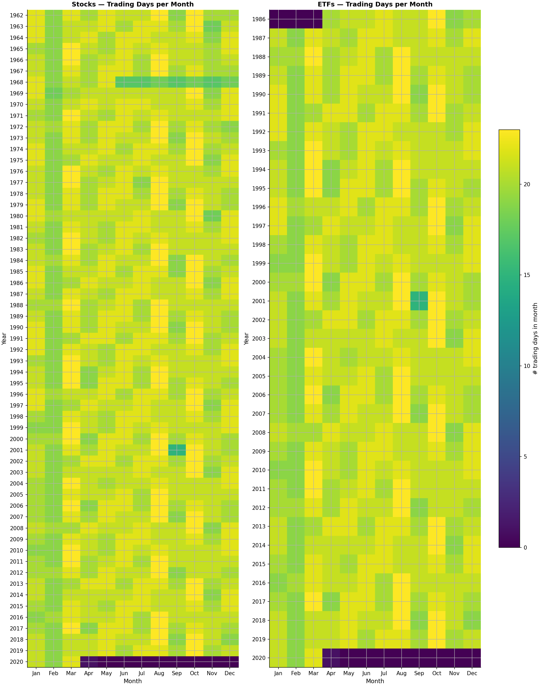
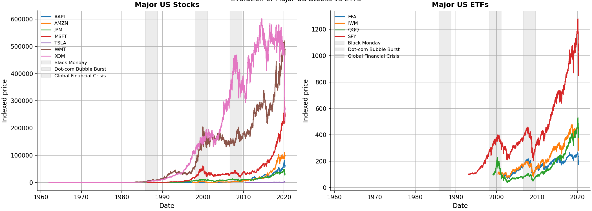
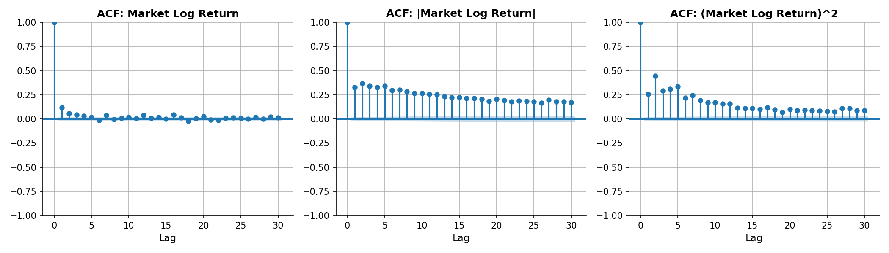
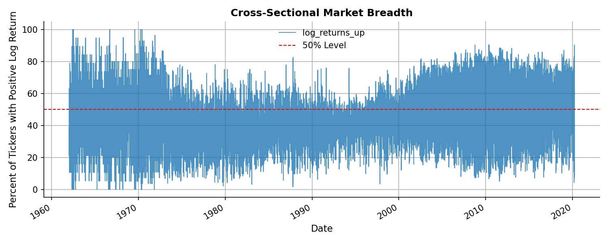
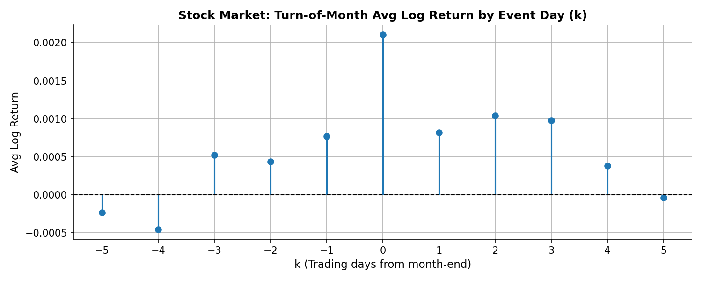
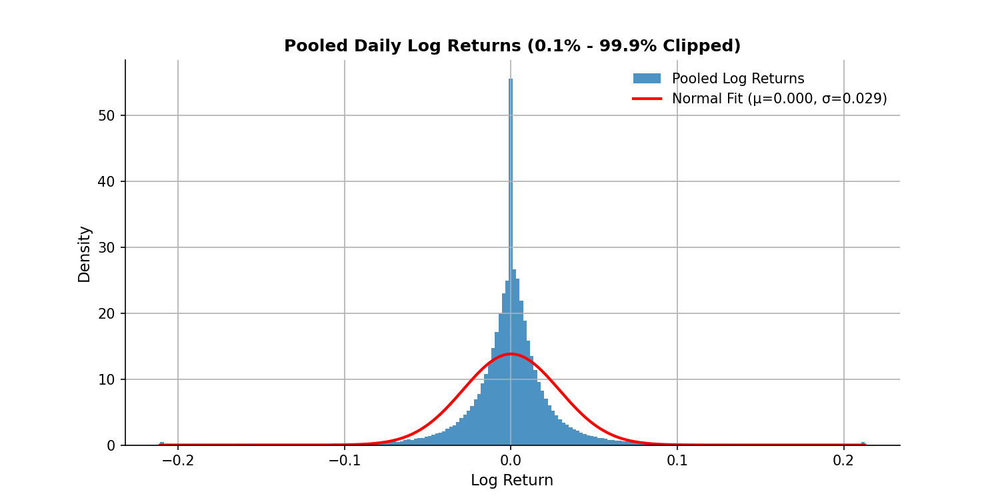
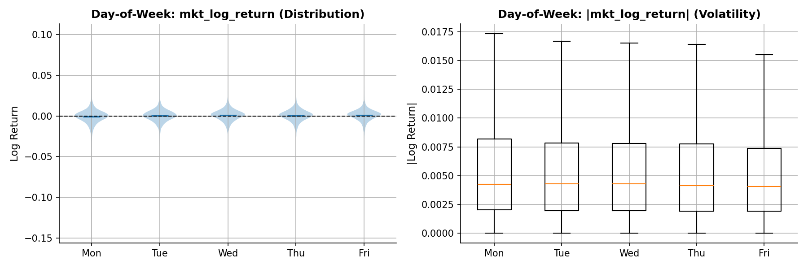
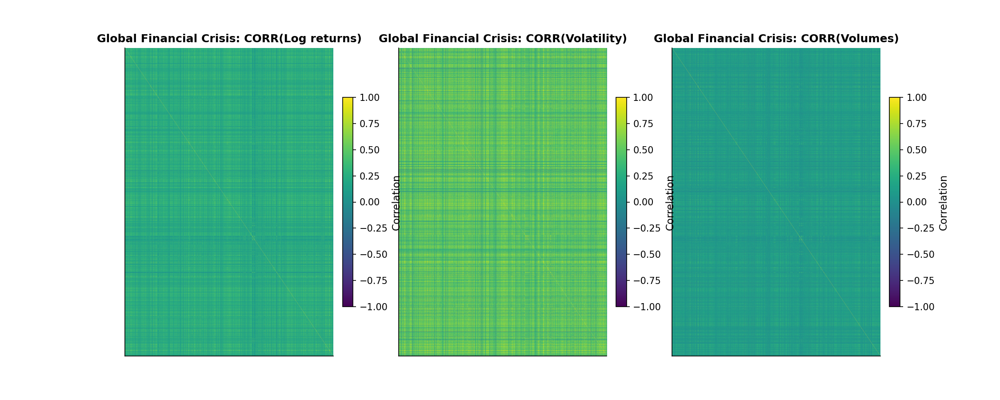

  

    <h1>Big Short: Are Investors Blind to Crisis Signals?</h1>
    

      Our goal isn't to turn you into professional traders overnight—we just want to give you the intuition needed to follow the story without feeling like you've stumbled into a secret Wall Street meeting. Think of this as Ryan Gosling in <em>The Big Short</em> giving you a friendly tour of the finance world, but without the sunglasses or the existential dread.
    

     
    

      We investigate whether investors overlook early crisis signals embedded in market-wide data. Focusing on U.S. stocks and ETFs, we examine three benchmark episodes: Black Monday (1987), the Dot-Com Bust (2000), and the Global Financial Crisis (2008).
    

  

  <h2>Glossary</h2>
  

    Before we dive in, let's equip you with the essentials.
  

  

    

      <h3>Financial Markets</h3>
      
Imagine a supermarket, but instead of apples, people buy and sell tiny pieces of companies (Stocks) or baskets of them (ETFs).

    

    

      <h3>Stock vs. Share</h3>
      
A <strong>Stock</strong> is the 'pizza' (ownership in a company). A <strong>Share</strong> is a single slice of that pizza.

    

    

      <h3>ETF</h3>
      
The entire buffet tray. A single product holding hundreds of stocks. Safer, smoother, less dramatic.

    

    

      <h3>Market Breadth</h3>
      
The percentage of stocks moving in the same direction. If most rise together, the rally is robust.

    

    

      <h3>Returns</h3>
      
How much a price changed. We use <strong>Log Returns</strong> because they behave better mathematically.

    

    

      <h3>Drawdown</h3>
      
The pain metric. How far the market has fallen from its previous peak.

    

    

      <h3>Autocorrelation</h3>
      
Market memory. How similar is today's behavior to yesterday's?

    

  

  <h2>Data Story</h2>
  

    Before we jump into the charts and heatmaps, let us give you a quick roadmap of how this data story unfolds. Think of it as the trailer before the movie — no spoilers, just enough to get you hooked. We begin with a light Introductory General Analysis to get familiar with the dataset and understand the basic behaviour of stocks and ETFs. From there, we widen the lens in the Cross-Sectional Market-Oriented Analysis, where we explore how the market behaves as a whole — autocorrelation, seasonality, broad signals, the kind of stuff that tells us whether the market is chilled out or having a midlife crisis. Then we shift gears into the Industry-Oriented Analysis, because not all sectors move together, and some tend to sense trouble earlier than others. Finally, we arrive at the centrepiece of this project: the Crisis-Oriented Analysis, where we tackle our research questions head-on and search for hints of stress in the years leading up to major financial crashes. All wrapped up with a conclusion and a quick meet-the-team moment.
  

  

    <h3>Introductory General Analysis</h3>
    

      We begin with the raw material. Unlike crypto, stocks trade only on business days (~252/year). We check for gaps to ensure data quality.
    

  

  

    
    
Trading Days per Month. Note the gaps in Sept 2001 due to 9/11.

  

  

    

      Price charts are like character introductions. We meet the main characters: Apple, Amazon, Microsoft...
    

  

  

    
    
Evolution of Major US Stocks vs ETFs. Note the difference in volatility.

  

  

    

      Prices wander, but <strong>Returns</strong> tell the story. We observe <strong>Volatility Clustering</strong>: markets have moods. Calm periods cluster together, as do stormy ones.
    

  

  

    
    
Simple vs Log Returns for AAPL. Volatility clusters are clearly visible.

  

  

    

      Are returns Normal? We check with a QQ Plot. Log returns align closer to the theoretical normal distribution.
    

  

  

    
    
Normality Investigation: QQ Plots.

  

  

    <h2>Market Analysis</h2>
    

      Zooming out to the aggregate market. We built a 'Market' index by averaging all stocks.
    

    

      Autocorrelation reveals that while returns have short memory, <strong>Volatility</strong> (absolute returns) has a long memory. The market remembers fear.
    

  

  

    
    
Autocorrelation of Returns vs. Volatility.

  

  

    

      <strong>Market Breadth</strong>: Are we moving as a team?
    

  

  

    
    
Cross-Sectional Market Breadth.

  

  

    

      Investing carries risk. The <strong>Drawdown</strong> chart shows the historic crashes we aim to predict.
    

  

  

    <iframe src="assets/charts/eda_stock_market_drawdown.html" class="plotly-chart"></iframe>
    
Cumulative Return and Drawdown.

  

  

    

      <strong>Seasonality</strong>: Markets have routines. We check for Day-of-Week and Month-of-Year patterns.
    

  

  

    

      
      
Seasonality in Stock Market Returns.

    

    

      
      
Turn-of-Month Effect: Returns tend to be higher around month-end.

    

  

  

    <h2>Industry-Oriented Analysis</h2>
    

      After examining individual stocks, ETFs, and their aggregated market behaviour, there is one more perspective we need before diving into crises: industries. Financial markets are not a single homogeneous block — different sectors respond differently to economic shocks, liquidity cycles, and macro uncertainty. Some move early, some react late, and understanding these dynamics gives us a sharper lens for identifying pre-crisis patterns.
    

    

      To perform industry-level analysis, we first assign each stock in our dataset to an industry category (actually, we've already done this in the previous sections). This is done using an external mapping: a classification file that links each ticker to its corresponding sector. Once merged, our dataframe gains a new column, industry, which allows us to group stocks not only by date or asset type but by their economic function. For the sake of simplicity and understanding, we have decided to focus our industry-oriented analysis on stock market only.
    

  

  

    <h3>Distribution of Log Returns</h3>
    

      A natural first question is: how do log returns (i.e., one of the main players so far) differ across industries? Some sectors are known to be inherently more volatile (like technology), while others are more stable (like utilities). A distributional comparison helps reveal which industries carry larger day-to-day movements and which tend to fluctuate less dramatically.
    

  

  

    
    
Distribution of Log Returns by Sector.

  

  

    <h3>Distribution of Volume</h3>
    

      We then extend the same investigation to trading volumes, which vary significantly across industries. Certain sectors attract persistent attention and heavy trading, while others are active only around specific events or cycles. Understanding volume behaviour helps identify which parts of the market drive liquidity and which remain relatively quiet.
    

  

  

    
    
Distribution of Volume by Sector.

  

  

    <h3>Risk Profiles (Boxplots)</h3>
    

      Histograms are a helpful first step, but they don't show medians, outliers, or intra-industry dispersion. To uncover these details, we turn to boxplots of returns and volumes. These visualizations help us compare industry risk profiles, identify asymmetric behaviour, and observe the presence of extreme events.
    

  

  

    
    
Distributions of Log Returns and Volume by Industry (boxplots).

  

  

    <h3>Industry Correlations</h3>
    

      Finally, industries rarely move in isolation. When uncertainty rises, sectors often become more correlated; when conditions stabilize, they decouple. Looking at correlation matrices gives us insight into how industries interact under normal conditions and provides intuition for what may happen as we approach a crisis.
    

  

  

    
    
Correlation of LogReturn across industries.

  

  

    <h2>Crisis Analysis: The Core</h2>
    

      We focus on 3 periods: <strong>Black Monday (1987)</strong>, <strong>Dot-Com Bubble (2000)</strong>, and the <strong>Global Financial Crisis (2008)</strong>.
    

  

  

    <h3>1. Do common early-warning patterns exist?</h3>
    

      We want to see whether correlations, volatility, and market breadth display systematic behavior as markets approach instability. We compare correlations in the 2 years BEFORE a crisis vs. DURING the crisis. Correlations often tighten <em>during</em> the crash, but we look for the buildup <em>before</em>.
    

    <h4>Focus on Stock Market</h4>
  

  

    

      
      
Correlations Pre-Black Monday

    

    

      
      
Correlations During Black Monday

    

  

  
  

    

      
      
Correlations Pre-GFC

    

    

      
      
Correlations During GFC

    

  

  

    <h4>Dot-Com Bubble Burst (2000) - Focus on ETF Market</h4>
    

      The late 1990s were defined by intense speculation surrounding internet and technology companies. Stock prices soared despite many firms having questionable business models and minimal revenue—optimism was so high that some companies doubled in valuation just by adding ".com" to their names. On March 10, 2000, the bubble burst, triggering a prolonged collapse in tech valuations and a nearly 80% decline in the NASDAQ. Because this crisis was heavily sector-concentrated, it offers a natural laboratory for analysing industry-specific early-warning behaviour [cite: 1010-1013].
    

  

  

    <iframe src="assets/charts/interactive_correlation_dotcom_burst_etfs.html" class="plotly-chart"></iframe>
    
Correlation of ETF Log Returns, Volatility, and Volumes during the Dot-Com Bubble.

  

  

    <h4>Global Financial Crisis (2008) - Focus on ETF Market</h4>
    

      The 2008 crisis began with stresses in the U.S. mortgage market before expanding into a global financial meltdown. When Lehman Brothers filed for bankruptcy on September 15, 2008—the largest in U.S. history—panic rippled across markets. Excessive leverage, correlated defaults, and opaque derivatives created a deeply interconnected system that unravelled rapidly. Importantly, many studies suggest that structural tensions were already rising well before the crash—making 2008 the quintessential case for searching for pre-crisis signals [cite: 1017-1020].
    

  

  

    <iframe src="assets/charts/interactive_correlation_financial_crisis_etfs.html" class="plotly-chart"></iframe>
    
Correlation of ETF Log Returns, Volatility, and Volumes during the Global Financial Crisis.

  

  

    <h3>2. Do industries exhibit distinct pre-crisis behaviours?</h3>
    

      Some crises hit specific sectors first (e.g., tech in 2000, financials in 2008). We test whether sector-level signals emerge earlier or differ from the aggregate market.
    

    <h4>Black Monday (1987) - Industry Analysis</h4>
    

      Black Monday marks one of the most dramatic single-day collapses ever recorded: on October 19, 1987, the Dow Jones fell 22.6% in a single trading session—a number that would cause even seasoned traders to spill their coffee. The event remains puzzling because it seemed to come "out of thin air," with explanations ranging from automated trading mechanisms to liquidity shortages and inflation fears. Its suddenness makes it a perfect candidate for asking whether subtle warning signs existed beforehand [cite: 1004-1006].
    

  

  

    <iframe src="assets/charts/interactive_correlation_black_monday_industries.html" class="plotly-chart" style="height: 750px;"></iframe>
    
Industry Correlations: Black Monday.

  

  

    <h4>Dot-Com Bubble Burst (2000) - Industry Analysis</h4>
  

  

    <iframe src="assets/charts/interactive_correlation_dotcom_burst_industries.html" class="plotly-chart" style="height: 750px;"></iframe>
    
Industry Correlations: Dot-Com Bubble Burst.

  

  

    <h4>Global Financial Crisis (2008) - Industry Analysis</h4>
  

  

    <iframe src="assets/charts/interactive_correlation_gfc_industries.html" class="plotly-chart" style="height: 750px;"></iframe>
    
Industry Correlations: Global Financial Crisis.

  

  

    <h3>3. Systemic Risk (PCA)</h3>
    

      Principal Component Analysis (PCA) measures how much the market moves in lockstep. A high Explained Variance Ratio for PC1 indicates high systemic risk.
    

  

  
 

        
        
PCA Black Monday

      

      

        
        
PCA Dot-Com Bubble

      

      

        
        
PCA Global Financial Crisis

      

  

  

    <h3>4. Predictability via Breadth</h3>
    

      Does market breadth predict next-day returns? We run regressions to see if the slope is significant before a crash.
    

  

  

      

        
        
Regression Black Monday

      

      

        
        
Regression Dot-Com Bubble

      

      

        
        
Regression Global Financial Crisis

      

  

  <h2>Conclusion</h2>
  

    Financial crises do not always come out of nowhere. Our analysis suggests that rising correlations and systemic risk (PCA) often precede the crash. However, simple linear predictability (Breadth) is not a silver bullet. The market whispers, but it speaks a complex language.
  

  <h3>The Team</h3>
  
 Nicolò Baldovin, Demetrio F. Cardile, Alex Martinez, Tommaso Mencattini, Letizia Seveso.

