

  

    <h1>HOME</h1>
    
    

      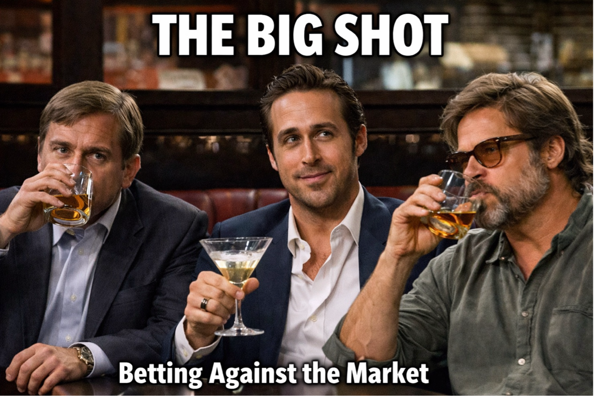
    

    
The title of this project, <em>The Big Shot</em>, is a deliberate nod to <em>The Big Short</em>, the movie that famously tells the story of a few investors who saw the cracks in the financial system before everyone else—and profited from it.

    
In the film, most market participants appear complacent, distracted, or willfully blind to mounting risks.

    
Our twist is in the word <em>Shot</em>: are investors missing the warning signs because they are metaphorically “drunk” on optimism, noise, and overconfidence?

    
Or are we unfairly blaming them for something that is, in reality, extremely hard—or even impossible—to see in advance?

    
This question lies at the heart of our project. Financial crises are often explained <em>after the fact</em> with narratives that make them sound obvious in hindsight.

    
But hindsight is a powerful illusion. What we aim to do is step back into the moments <em>before</em> major crises and ask a simple but crucial question: were there observable, systematic patterns in the data that could have warned investors that something was about to break?

    
Or did markets genuinely behave in a way that made crises indistinguishable from normal times until it was too late?

    

      
    

    
The scope of this project is therefore not to build a trading strategy, nor to claim that crises can be predicted with certainty.

    
Instead, we focus on understanding market behavior through the lens of data.

    
Using decades of U.S. stock and ETF data, we explore how correlations, volatility, market participation, and industry-level dynamics evolve over time, with particular attention to the periods preceding and during major financial crises.

    
Our goal is to assess whether markets show signs of increasing fragility—such as rising synchronization or shrinking breadth—before they collapse, or whether these patterns only become visible once the crisis is already underway.

    
The structure of our analysis reflects this investigative journey. We begin by grounding the reader with a concise glossary, ensuring that all key financial concepts used throughout the project are accessible, even to those without a finance background.

    
We then move into an introductory data exploration, where we familiarize ourselves with the datasets, their structure, and some fundamental stylized facts of financial markets.

    
From there, we progressively zoom out: first examining the market at an aggregate level through cross-sectional analyses, then shifting focus to industry-level behavior to see whether certain sectors behave differently ahead of crises.

    
Finally, we arrive at the core of the project: a crisis-oriented analysis in which we directly compare pre-crisis and during-crisis periods across multiple historical events.

    
In the spirit of <em>The Big Short</em>, the narrative is meant to be engaging, occasionally ironic, and always grounded in evidence.

    
By the end of this project, we hope to provide a clear answer to our central dilemma: are investors missing obvious warning signs, or are crises truly the kind of events that only make sense once the damage is already done?

  

  <h2>GLOSSARY</h2>
  
Before we dive into our analysis, let’s take a moment to make sure everyone is equipped with the basic financial concepts we’ll use throughout this website.

  
Our goal isn’t to turn you into professional traders overnight — we just want to give you the intuition needed to follow the story without feeling like you’ve stumbled into a secret Wall Street meeting.

  
Think of this as Ryan Gosling in <em>The Big Short</em> giving you a friendly tour of the finance world, but without the sunglasses or the existential dread.

  

    
    

      <h3>Financial Markets</h3>
      
We start with the idea of <strong>financial markets</strong>, which you can imagine as a supermarket — but instead of apples and pasta, people buy and sell tiny pieces of companies.

      
There are customers (market takers) who want to buy or sell something, and market makers who make sure these “items” are always available.

      
Markets exist because companies need money and investors look for opportunities; the system works as long as both sides keep showing up.

    

    

      <h3>Stock vs. Share</h3>
      
To understand what’s being traded, we introduce the concept of a <strong>stock</strong>, which is simply a slice of ownership in a company.

      
If the company does well, the value of that slice increases; if it doesn’t, the slice shrinks.

      
A <strong>share</strong> is just one of those slices — a single unit of ownership.

      
If a company is sliced into one million shares and you own ten thousand, you control 1% of the whole thing.

      
People often mix up <strong>stocks</strong> and <strong>shares</strong>, but the distinction is simple: “stock” refers to ownership in general, while “shares” refer to specific, countable units.

      
Think of stock as the pizza, and shares as the individual slices.

    

    

      <h3>ETF</h3>
      
Next comes the <strong>ETF</strong>, or Exchange-Traded Fund. If stocks are slices of a pizza, an ETF is more like the entire buffet tray — a single product that holds dozens or even hundreds of stocks together.

      
It’s safer, smoother, and less dramatic. In the notebook, we show a comparison of how a single stock’s volatility behaves versus the volatility of a diversified ETF.

      
Spoiler: the stock behaves like your one chaotic friend who keeps moving between cities, while the ETF acts like the calm friend who labels their spice jars.

    

    

      <h3>Market Breadth</h3>
      
Another key concept we use throughout the analysis is <strong>market breadth</strong>, which tells us how many stocks are actually moving in the same direction on a given day.

      
If only a handful rise while the rest fall, the market is being carried by a few overachievers.

      
If most stocks rise together, the market movement is broad and robust.

      
Breadth is one of our main tools to understand what happens before crises.

    

    

      <h3>Returns & Log Returns</h3>
      
We also talk about <strong>returns</strong>, which simply measure how much a stock’s price changed from one day to the next.

      
Did it go up? Down? By how much? That’s the return.

      
A related idea is the <strong>log return</strong>, a slightly more sophisticated version that behaves nicely in models and is loved by economists everywhere.

      
Don’t worry: the notebook handles the math. All you need to know is that both reflect price changes — one just plays nicer with statistics.

    

    

      <h3>Drawdown</h3>
      
Crises involve losses, so we introduce the idea of a <strong>drawdown</strong>, which measures how far a stock or market has fallen from its previous peak.

      
It’s the financial equivalent of realizing how much your GPA dropped after that “experimental” semester.

    

    

      <h3>Autocorrelation</h3>
      
Finally, we mention <strong>autocorrelation</strong>, which looks at how similar today’s market behaviour is to yesterday’s, or last week’s.

      
If the market has memory, autocorrelation picks it up. If it behaves like your cat — completely unpredictable — autocorrelation will show that too.

      
The autocorrelation function simply shows these relationships across different time lags.

    

  

  

    
With these concepts in hand, you’re fully ready to follow our analysis.

    
No jargon, no intimidation — just the essentials you need to navigate the data story ahead.

    
Now that the glossary is behind us, let’s step into the real action.

    
And for the rest of this website, consider yourself an honorary finance expert. Ryan Gosling would approve.

    
    

        
    

  

  <h2>DATA STORY</h2>
  
Before we jump into the charts and heatmaps, let us give you a quick roadmap of how this data story unfolds.

  
Think of it as the trailer before the movie — no spoilers, just enough to get you hooked.

  
We begin with a light <strong>Introductory General Analysis</strong> to get familiar with the dataset and understand the basic behaviour of stocks and ETFs.

  
From there, we widen the lens in the <strong>Cross-Sectional Market-Oriented Analysis</strong>, where we explore how the market behaves as a whole — autocorrelation, seasonality, broad signals, the kind of stuff that tells us whether the market is chilled out or having a midlife crisis.

  
Then we shift gears into the <strong>Industry-Oriented Analysis</strong>, because not all sectors move together, and some tend to sense trouble earlier than others.

  
Finally, we arrive at the centrepiece of this project: the <strong>Crisis-Oriented Analysis</strong>, where we tackle our research questions head-on and search for hints of stress in the years leading up to major financial crashes.

  
All wrapped up with a conclusion and a quick meet-the-team moment.

  <h3>Introductory General Analysis</h3>
  
Now that we’ve walked through the essential financial concepts, it’s time to roll up our sleeves and look at the actual data behind our story.

  
Our journey begins with the raw material: the original dataframes we were given, one for stocks and one for ETFs.

  
These tables are the backbone of everything we do, so it’s important to get familiar with their structure before we start hunting for crisis signals.

  
Each row represents a specific asset on a specific day, and each column records things like opening price, closing price, trading volume, and so on — the daily diary of thousands of financial instruments.

  

      
  

  

    <h3>Clean Stock prices (Head)</h3>
    

      
    

    <h3>Clean ETFs prices (Head)</h3>
    

      
    

   
     <!-- 

      
<strong>Feature Interpretation:</strong>

      <ul>
        <li><strong>Log Return:</strong> The aggregated daily log-return of the market...</li>
        <li><strong>Volatility:</strong> A rolling measure of standard deviation...</li>
      </ul>
    
 -->
  

  
  
These tables show a snapshot of the raw datasets we start from for our analysis, one for individual stocks and one for ETFs.

  
Each row corresponds to a single traded asset on a given trading day, identified by its <strong>Date</strong> and <strong>Ticker</strong>.

  
The price information follows the standard market convention: Open, High, Low, and Close record the intraday evolution of prices, while Adj Close adjusts the closing price for corporate actions such as stock splits or dividends, making it suitable for return calculations.

  
Trading activity is captured by Volume, which measures how many shares (or ETF units) were exchanged during the day.

  
To help us distinguish liquid from potentially noisy observations, we also include MedianVolume, a reference level computed over time for each asset, and a LowLiquidityFlag indicating days with unusually low trading activity.

  
For stocks, we additionally observe a Sector classification, which later allows us to aggregate assets by industry and investigate sector-specific dynamics.

  
Overall, these tables highlight the panel structure of the data: many assets observed repeatedly over time.

  
This format is the backbone of our project, as it enables both cross-sectional analyses (comparing many assets on the same day) and time-series analyses (tracking how market behavior evolves across decades and around major financial crises).

  
Before getting too excited about analysis, we need to make sure our data contains every day where trading actually happened.

  
Unlike crypto (which trades 24/7 because crypto bros apparently never sleep), stocks and ETFs only trade on business days — roughly 252 days a year.

  
Markets can close unexpectedly as well, sometimes for reasons that are historic, tragic, or simply bureaucratic.

  
So a natural first step is to check whether our dataset matches the real-world trading calendar or whether it’s missing days like your friend who keeps skipping gym sessions but insists they’re “still committed.”

  

    <iframe src="assets/charts/eda_calendar_heatmap_stock_etfs.html" class="plotly-chart"></iframe>
  

  
This heatmap confirms that the datasets are largely complete and internally consistent with how financial markets operate.

  
As expected, <strong>February systematically shows fewer trading days</strong> than other months, reflecting its shorter calendar length.

  
A striking exception appears in <strong>September and October 2001</strong>, where the sharp drop in trading days clearly corresponds to the temporary closure of U.S. financial markets following the <strong>September 11 terrorist attacks</strong> —a reassuring sign that the data correctly reflects real-world disruptions rather than data errors.

  
Aside from these historically well-defined events, the dataset appears remarkably stable over time.

  
Only <strong>very minor irregularities</strong>, such as a slight reduction in trading days in the <strong>final months of 1968</strong>, are observed.

  
Overall, this visualization provides strong evidence that our data coverage across decades is reliable and suitable for studying market behavior around major crises.

  
With the foundation set, let’s start exploring the market’s behaviour.

  
Before we even think about crises or early-warning signals, it helps to get a feel for how some well-known stocks and ETFs move over time.

  
But please note: price charts aren’t there to predict the future — they’re more like character introductions in a movie.

  
You meet Apple, Amazon, Microsoft, Tesla… each with its own personality and its own dramatic arcs (and in Tesla’s case, its own main character energy).

  

    <iframe src="assets/charts/compare_stock_etf_evolution.html" class="plotly-chart"></iframe>
  

  
Overall, these preliminary visualizations help us understand how financial assets behave over time, but they also highlight a key limitation: even when long-term upward trends are visible, they do <strong>not</strong> guarantee profits.

  
In finance, prices are often modeled as following a <strong>random walk</strong>, meaning that future movements cannot be reliably predicted from past prices, as new information arrives unpredictably and is quickly incorporated by markets.

  
This is why our analysis does not aim to forecast prices, but instead focuses on <strong>returns, volatility, correlations, and market participation</strong>, which allow us to describe market behavior and evolving risk without claiming any certainty of becoming rich.

  
This leads us to one of the most fundamental ideas in finance: <strong>we never work with raw prices</strong>.

  
Prices wander aimlessly, drift unpredictably, and — according to many theories — behave like a random walk.

  
Trying to model prices is like trying to predict your toddler’s next move: possible in theory, dangerous in practice.

  
What we analyse instead are <strong>returns</strong>, which capture how much a price changes from one moment to the next.

  
And even among returns, we tend to favor log returns, partly because they’re mathematically convenient, and partly because they behave more politely in statistical models.

  

      
  

  
To illustrate the contrast, we can look at returns from both viewpoints — simple and logarithmic — for a single stock and a single ETF.

  
This gives us a nice visual introduction to a important phenomenon: <strong>volatility clustering</strong>, the idea that calm periods and stormy periods tend to come in waves.

  
Markets, it turns out, have moods.

  

    <iframe src="assets/charts/comparison_return_log_return.html" class="plotly-chart"></iframe>
  

  
These plots highlight two key stylized facts of financial markets.

  
First, <strong>log returns appear much more stable over time than prices or simple returns</strong>, oscillating around a roughly constant mean and avoiding the compounding distortions visible in simple returns.

  
This makes log returns particularly suitable for statistical analysis.

  

      
  

  
Second, both AAPL and SPY clearly exhibit <strong>volatility clustering</strong>: periods of calm with small fluctuations are followed by periods of intense turbulence, especially around major crises.

  
Large absolute returns tend to occur in bursts rather than in isolation, suggesting that while returns themselves are hard to predict, <strong>the level of risk is persistent over time</strong>.

  
Volatility clustering is one of the recurring characters of financial markets — like that one actor who appears in every Christopher Nolan film.

  
It’s everywhere, and once you see it, you start noticing it all the time.

  
We’ll explore this idea in depth later, but for now, it’s enough to appreciate that markets don’t just bounce around randomly — they have periods of tranquillity and periods of chaos, and they tend to stick together in clusters.

  

      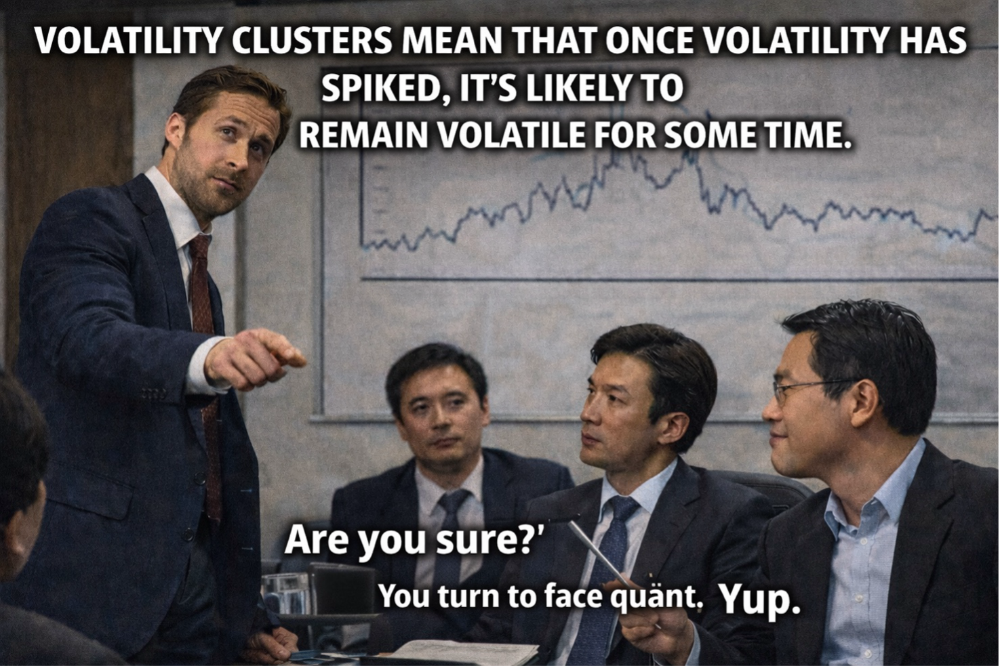
  

  
Returning to our discussion of returns versus log returns, there is another reason log returns are preferred: they often look more “normal” — statistically speaking, not emotionally.

  
To demonstrate this, we turn to a tool called a <strong>QQ plot</strong>, which checks whether data follows a normal distribution.

  
It’s like holding up your dataset to a mirror and asking, “Do you look normal today?”

  
Spoiler: simple returns usually say no.

  

    
  

  
These figures show that neither simple nor log returns are perfectly normally distributed, but <strong>log returns are noticeably closer to normality</strong>.

  
The histograms reveal a sharp peak around zero for both measures, along with heavy tails, indicating the presence of extreme events more frequent than a normal distribution would predict.

  
This is confirmed by the QQ-plots: while both return types deviate from the straight reference line in the tails, <strong>log returns align more closely with the normal distribution in the central region</strong>, whereas simple returns display stronger distortions.

  
Overall, this supports the common practice in finance of working with log returns, which offer more stable statistical properties while still capturing the risk of extreme movements.

  
With these insights under our belt, we now have a solid grasp of how financial time series behave — their quirks, their moods, and their statistical surprises.

  
This early exploration sets the tone for everything that follows.

  
Before tackling the main research questions, it’s essential to understand the raw material we’re working with.

  
And now that we’ve peeled back the first layer, it’s time to dive deeper into the story that markets tell us before crises hit.

  <h3>Cross-Sectional Market-Oriented Analysis</h3>
  
After exploring individual stocks and ETFs in the previous section, it’s time to zoom out — way out — and look at the market as a whole.

  
If the earlier part was about meeting the cast, this section is about understanding the entire ensemble.

  
Think Avengers-level coordination… except half the characters don’t show up on Mondays and the rest panic every time the Fed speaks.

  
When we talk about <strong>the</strong> market, we don’t refer to some mysterious entity living on Wall Street.

  
The market is simply the aggregation of all the individual assets that trade on a given day.

  
In our case, that means one aggregated “market” for stocks and another for ETFs.

  
But how do we build these markets from the raw dataframes we were given?

  
  

      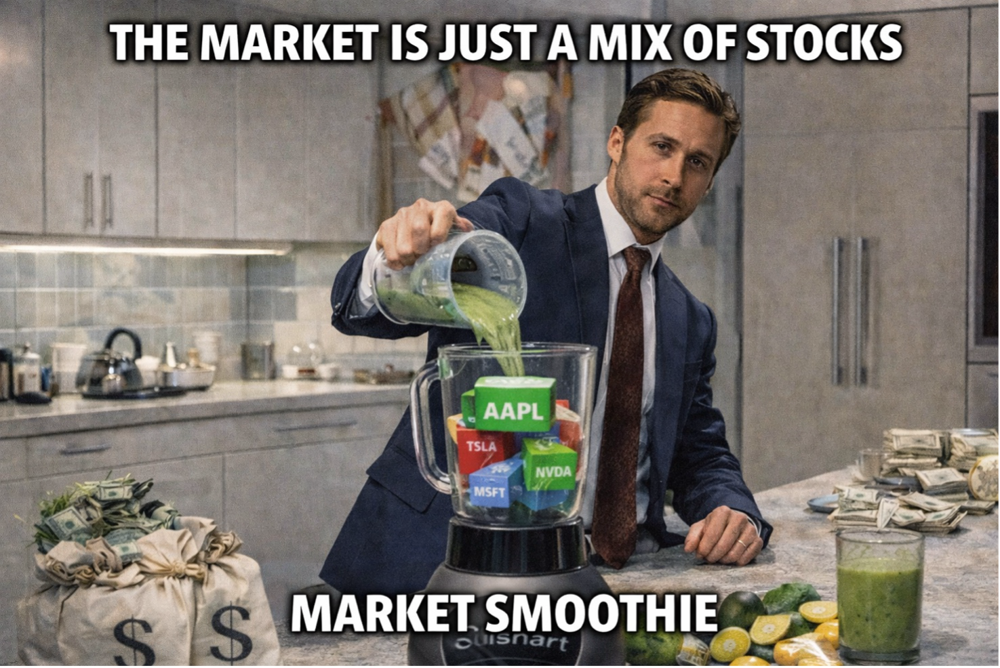
  

  
Our original data comes in the format <strong>(day, ticker, features)</strong> — a giant vertical table with thousands of tickers spread across many decades.

  
To construct a market-level view, we group everything by date and compute the average of the feature of interest for that day.

  
Do this for every feature, repeat the procedure for both stocks and ETFs, and voilà: we transform a chaotic universe of tickers into a pair of tidy, time-indexed dataframes.

  
Think of it as blending a thousand ingredients into two smooth smoothies — one stock-flavored, one ETF-flavored.

  
For the sake of simplicity and clarity, we show a glimpse of our two new-born dataframes below (first for the stock market, then for the ETF market).

  

    <h3>Stock Market Aggregated Data (Tail)</h3>
    

      
    

    <h3>ETF Market Aggregated Data (Tail)</h3>
    

      
    

    
    

      
<strong>Feature Interpretation:</strong>

      <ul>
        <li><strong>Log Return:</strong> The aggregated daily log-return of the market...</li>
        <li><strong>Volatility:</strong> A rolling measure of standard deviation...</li>
      </ul>
    

  

  
  
Earlier, we introduced one of the most fascinating quirks of financial markets: <strong>volatility clustering</strong>.

  
In human terms, markets behave like emotional teenagers: periods of calm suddenly give way to storms, and storms lead to more storms.

  
Or, stated more academically: <strong>large changes tend to be followed by large changes, and small changes tend to be followed by small changes</strong>.

  
Understanding this can be incredibly useful — if volatility has been calm for a while, odds are something louder may be waiting just around the corner, and vice versa.

  
To visualize this phenomenon, we look at the <strong>autocorrelation function</strong> computed on market-level returns, on absolute returns, and on squared returns. And this time we compute it cross-sectionally — because we’re now operating at the market level, not on individual tickers.

  

    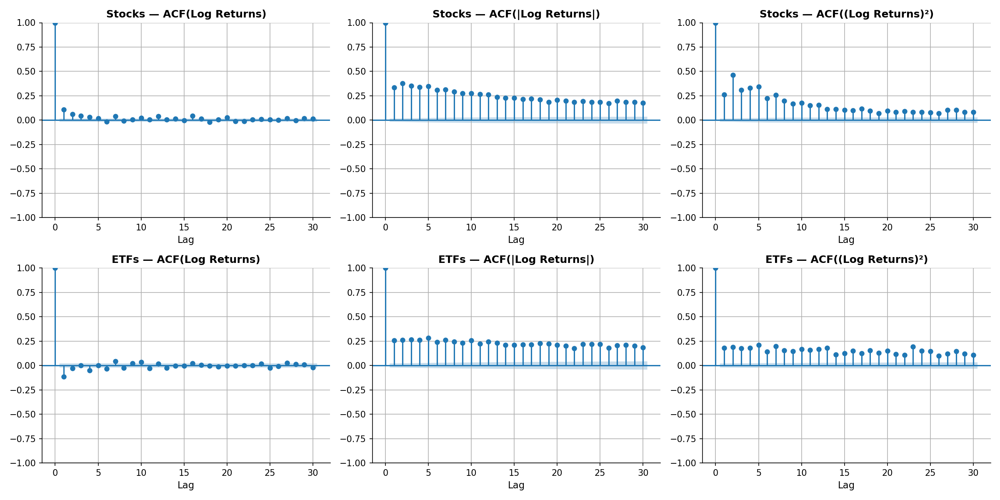
  

  
These autocorrelation plots clearly illustrate another classic feature of financial data.

  
Raw log returns show <strong>very little autocorrelation</strong>, with correlations quickly dropping to values close to zero after the first few lags.

  
This indicates that returns themselves are largely unpredictable from their past, consistent with the idea of market efficiency.

  
In contrast, the autocorrelation of <strong>absolute returns</strong> and <strong>squared returns</strong> remains positive and decays much more slowly over time.

  
This persistence reflects <strong>volatility clustering</strong>: periods of high volatility tend to be followed by further periods of high volatility, and calm periods tend to cluster together as well.

  
While we cannot forecast the <strong>direction</strong> of future returns, these patterns show that we can learn something about the <strong>intensity of market fluctuations</strong> over time.

  
Since we’re working with aggregated data, this is also the perfect moment to revisit <strong>market breadth</strong>, our measure of how many stocks are rising on any given day.

  
Breadth tells us whether the market is moving as a team or relying on a couple of over-motivated players.

  
A market rally led by only three companies is like a football match where the main attacker scores all the goals — impressive, but not exactly reassuring.

  

    <iframe src="assets/charts/eda_market_breadth_stock.html" class="plotly-chart"></iframe>
  

  

    <iframe src="assets/charts/eda_market_breadth_etfs.html" class="plotly-chart"></iframe>
  

  
At first glance, the series looks like the heartbeat of someone drinking their third espresso of the morning: sharp spikes, deep dips, no smooth trend.

  
If you looked only at this plot, you might conclude that investing is pure chaos and no rational human should do it.

  
But long-run investors know better: diversification and time tend to calm the storm.

  
Still, it is true that equity markets carry meaningful risk compared to safer assets.

  
To quantify this risk properly, we introduce <strong>maximum drawdown</strong>, which tells us how much a market falls from its previous peak — the financial equivalent of checking how far your fitness level drops after skipping the gym for six months.

  
  

    <iframe src="assets/charts/eda_stock_market_drawdown.html" class="plotly-chart"></iframe>
  

  

    <iframe src="assets/charts/eda_etf_market_drawdown.html" class="plotly-chart"></iframe>
  

  
These plots show cumulative market returns alongside drawdowns, highlighting both long-term growth and periods of significant losses.

  
The ETF market follows a smoother and more steadily increasing path, reflecting the stabilizing role of diversification, while the stock market appears flatter for much of the sample due to its very long historical span, changing market composition, and the impact of repeated major crises.

  
Overall, the figures underline a key message of this project: financial markets do grow over time, but that growth is punctuated by deep and recurring downturns that investors must endure.

  
Another classic theme in financial markets is <strong>seasonality</strong>. Just like people have routines, markets often exhibit cyclical patterns: some days of the week may be more volatile, some months may show stronger returns, and some periods — like the beginning or end of a cycle — tend to attract more trading activity.To test whether these patterns hold in our dataset, we examine how market returns behave across days of the week and across months.

  

    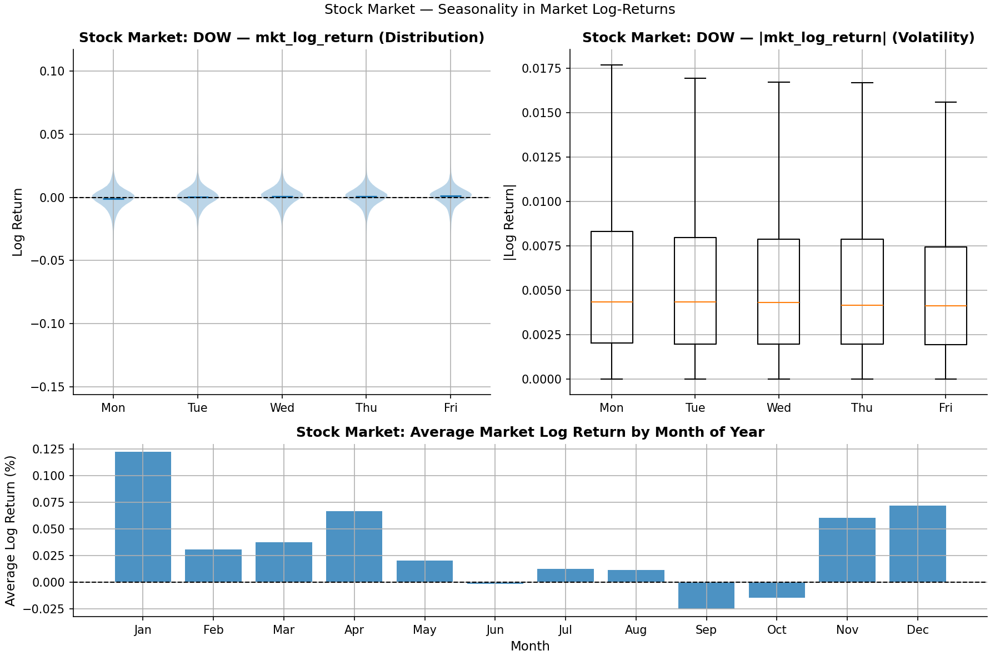
  

  

    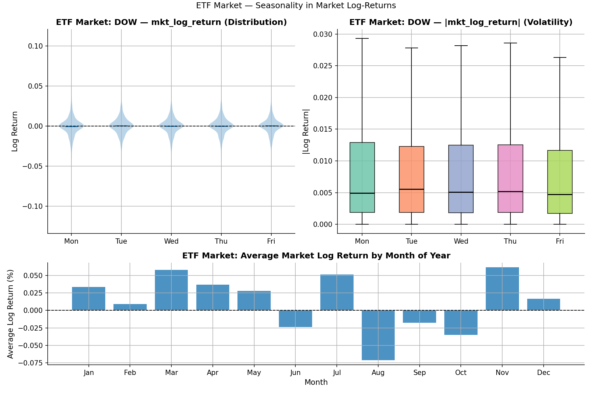
  

  
The first row of the subplot compares the distribution of daily returns across weekdays (left) with the volatility of absolute log-returns (right).

  
Taken together, these plots show no strong evidence that certain days systematically yield higher returns.

  
However, volatility appears more dispersed on Mondays—a pattern consistent with the typical increase in trading activity at the start of the week, which often leads to larger price fluctuations.

  
  

      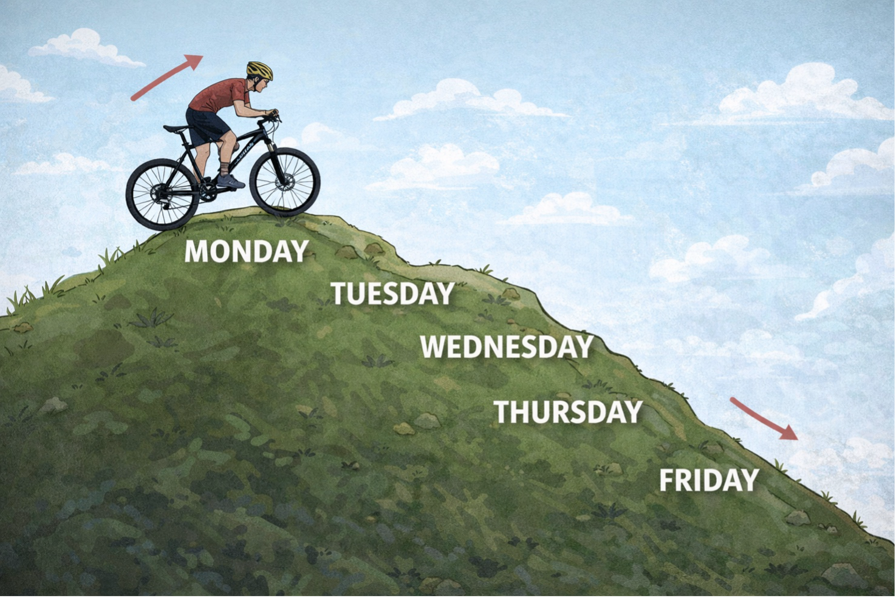
  

  
The second row presents a barplot of the average monthly log return.

  
Here, a clearer pattern emerges: returns tend to be higher in the early months of the year and again toward the end, while the summer months exhibit noticeably weaker performance.

  
This seasonal behavior aligns with well-documented market tendencies such as the “January effect” and the generally quieter summer trading period.

  
These findings are consistent with the well-known pattern that trading activity typically rises at both the beginning and the end of a trading cycle—whether weekly, monthly, or yearly.

  
Interestingly, the monthly pattern aligns with a well-documented truth: trading activity tends to ramp up at both the beginning and the end of a cycle — whether that cycle is a week, a month, or a year.

  
As a final check, we examine how returns behave around the <strong>end-of-month boundary</strong>, where liquidity and rebalancing decisions often kick in.

  

    <iframe src="assets/charts/eda_stock_tom_effect.html" class="plotly-chart"></iframe>
  

  

    <iframe src="assets/charts/eda_etf_tom_effect.html" class="plotly-chart"></iframe>
  

  
These plots suggest a clear <strong>turn-of-the-month effect</strong> in both the stock and ETF markets.

  
Returns tend to be weaker in the days just before month-end and become noticeably stronger right at, and immediately after, the turn of the month.

  
Day (k = 0) stands out in both panels, showing the highest average return, followed by positive performance in the first few trading days of the new month.

  
This pattern fits well with a simple market intuition: portfolio rebalancing, salary inflows, and institutional allocation decisions often cluster around month-end.

  
In short, while markets may look chaotic day to day, the calendar still leaves a small but persistent fingerprint on returns.

  
Taken together, these cross-sectional findings paint a richer portrait of how markets behave when observed from above.

  
We see bursts of volatility, persistent clustering, unpredictable swings in breadth, meaningful drawdowns, and subtle seasonal rhythms — all of which help set the stage for understanding what happens when crises unfold.

  
And as we’ll discover next, zooming further into industries reveals even more layers to the story.

  <h3>Industry-Oriented Analysis</h3>
  
After examining individual stocks, ETFs, and their aggregated market behaviour, there is one more perspective we need before diving into crises: industries.

  
Financial markets are not a single homogeneous block — different sectors respond differently to economic shocks, liquidity cycles, and macro uncertainty.

  
Some move early, some react late, and understanding these dynamics gives us a sharper lens for identifying pre-crisis patterns.

  
To perform industry-level analysis, we first assign each stock in our dataset to an industry category (actually, we’ve already done this in the previous sections).

  
This is done using an external mapping: a classification file that links each ticker to its corresponding sector.

  
Once merged, our dataframe gains a new column, <strong>industry</strong>, which allows us to group stocks not only by date or asset type but by their economic function.

  
For the sake of simplicity and understanding, we have decided to focus our industry-oriented analysis on stock market only.

  
Hence, we recall the panel from before.

  
  

      
  

  
A natural first question is: <strong>how do log returns</strong> (i.e., one of the main players so far) <strong>differ across industries?</strong>

  
Some sectors are known to be inherently more volatile (like technology), while others are more stable (like utilities).

  
A distributional comparison helps reveal which industries carry larger day-to-day movements and which tend to fluctuate less dramatically.

  

    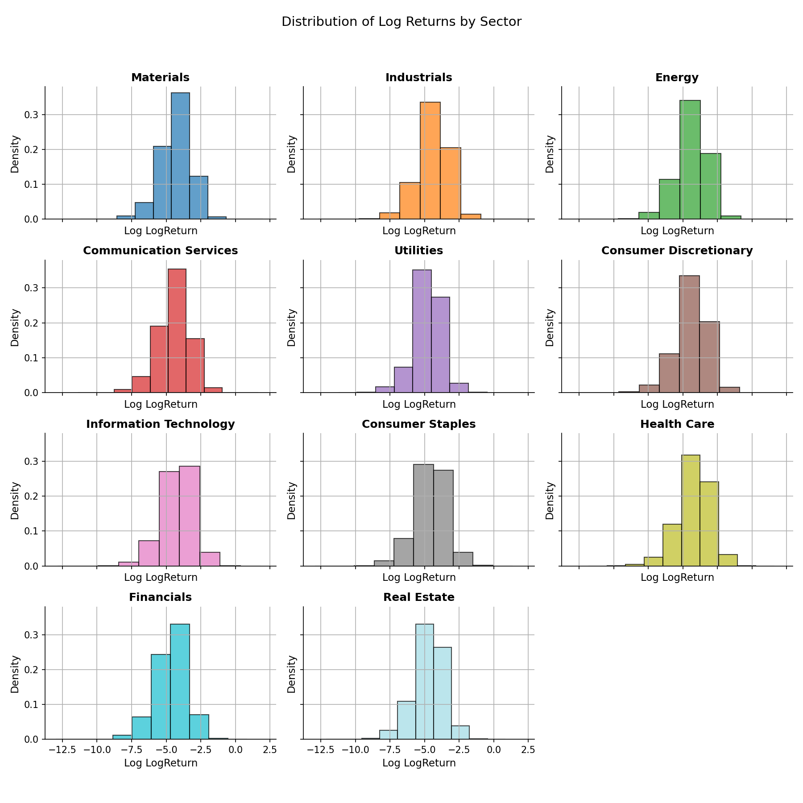
  

  
Across sectors, log returns are tightly centered around zero, confirming that <strong>large daily moves are rare</strong> and that most sectors behave similarly on average.

  
That said, some sectors—such as <strong>Energy and Consumer Discretionary</strong>—show slightly wider spreads, hinting at higher volatility, while more defensive sectors like <strong>Utilities and Consumer Staples</strong> appear more concentrated.

  
Overall, the distributions suggest common market-wide dynamics with sector-specific differences mainly reflected in risk rather than average returns.

  
We then extend the same investigation to <strong>trading volumes</strong>, which vary significantly across industries.

  
Certain sectors attract persistent attention and heavy trading, while others are active only around specific events or cycles.

  
Understanding volume behaviour helps identify which parts of the market drive liquidity and which remain relatively quiet.

  

    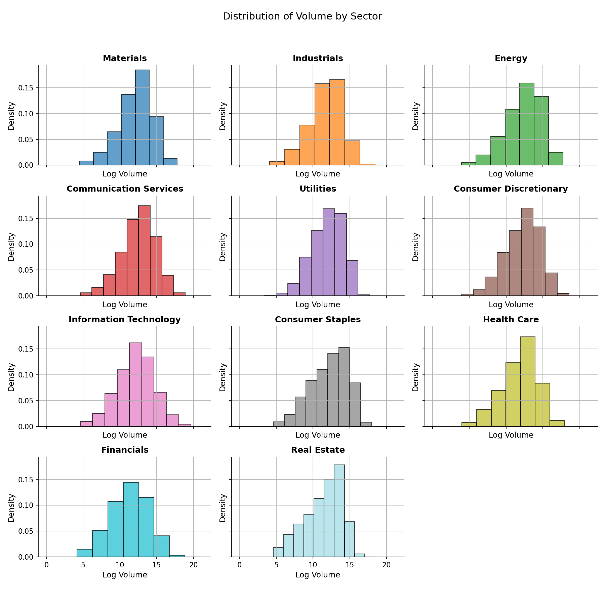
  

  
Trading volumes vary much more across sectors than returns. <strong>Information Technology, Financials, and Consumer Discretionary</strong> show higher and more dispersed volumes, reflecting stronger trading activity and investor attention, while <strong>Utilities and Real Estate</strong> appear more concentrated, consistent with their more defensive and less frequently traded nature.

  
Overall, volume highlights clear <strong>sector-specific participation patterns</strong>, even when return behavior looks broadly similar.

  
Histograms are a helpful first step, but they don’t show medians, outliers, or intra-industry dispersion.

  
To uncover these details, we turn to <strong>boxplots</strong> of returns and volumes.

  
These visualizations help us compare industry risk profiles, identify asymmetric behaviour, and observe the presence of extreme events.

  

    

      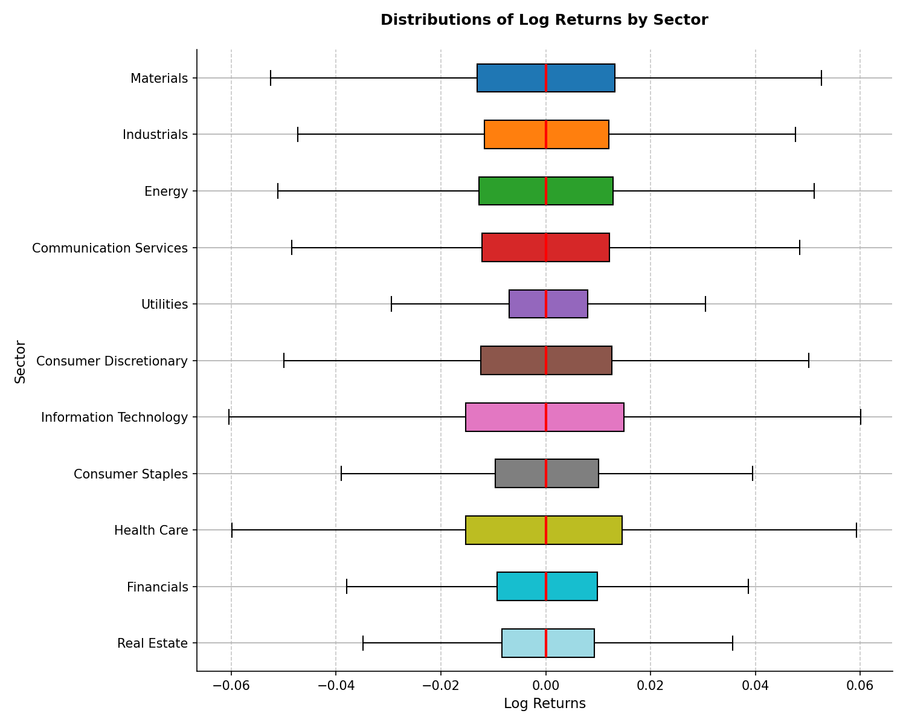
    

    
    

      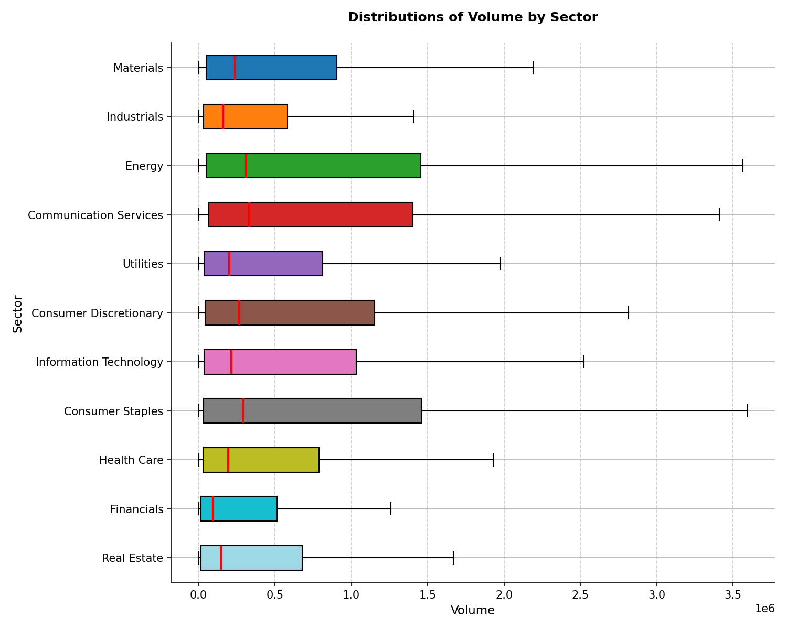
    

  

  
The boxplots of log returns by sector indicate that median returns are broadly similar across industries and tend to cluster around zero. What clearly differs is the dispersion of returns. More cyclical sectors such as Energy, Materials, and Consumer Discretionary display wider interquartile ranges and longer tails, signalling higher risk and a greater frequency of extreme outcomes. By contrast, defensive sectors like Utilities, Consumer Staples, and Health Care show tighter distributions, consistent with more stable return dynamics.

  
The boxplots of trading volumes by sector reveal much stronger heterogeneity. Sectors such as Information Technology, Financials, and Energy exhibit higher median volumes and greater dispersion, reflecting more intense and uneven trading activity. Defensive sectors generally show lower and more concentrated volume distributions. Overall, these figures highlight that while average returns are broadly comparable across sectors, risk and liquidity characteristics differ substantially, which is particularly relevant when studying market structure and behavior around crises.

  
Finally, industries rarely move in isolation. When uncertainty rises, sectors often become more correlated; when conditions stabilize, they decouple. Looking at <strong>correlation matrices</strong> gives us insight into how industries interact under normal conditions and provides intuition for what may happen as we approach a crisis.

  

    
  

  
The heatmap shows that industry-level log returns are strongly and positively correlated, indicating that sectors generally move together rather than independently. Cyclical industries such as Financials, Industrials, Consumer Discretionary, and Information Technology exhibit especially high mutual correlations, reflecting their shared exposure to common macroeconomic and market-wide forces.

  
In contrast, Utilities display noticeably lower correlations with most other sectors, consistent with their more defensive nature and relatively stable cash-flow profiles. Overall, this pattern suggests that sector diversification provides only limited risk reduction, particularly during periods of market stress when correlations tend to rise—an insight that becomes especially important in the crisis-oriented analysis.

  
Taken together, this industry-level perspective gives us a more complete picture of market structure. It allows us to see which sectors amplify volatility, which absorb shocks, and how information spreads across the market.

  
This broader understanding becomes crucial when we turn to our main goal: identifying whether industries — and therefore the market — exhibit warning signs in the years leading up to major financial crises.

  <h3>Crisis-Oriented Analysis</h3>
  
We now enter the most important part of our project — the section where everything we have built so far finally converges. Until now, we explored how individual stocks move, how markets behave in aggregate, and how industries interact. With that foundation, we are ready to confront the key question that inspired this entire analysis: <strong>do financial crises come out of nowhere, or does the market whisper its warnings before it screams?</strong>

  
  

      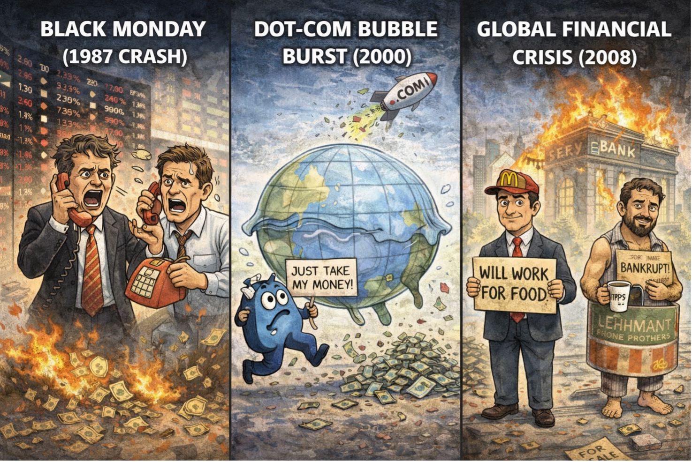
  

  
To answer this, we revisit the three research questions that guide our investigation:

  
Do common early-warning patterns exist in the pre/during financial crises windows?

  
We want to see whether correlations, volatility, and market breadth display systematic behavior as markets approach instability.

  
Do industries exhibit distinct behaviours leading up to a crisis?

  
Some crises hit specific sectors first (e.g., tech in 2000, financials in 2008).

  
We test whether sector-level signals emerge earlier or differ from the aggregate market.

  
Does cross-sectional market breadth predict next-day returns before crises —and does this predictive link collapse when chaos begins?

  
To study these questions rigorously, we focus on three major U.S. crises for which we have clear timing, rich dynamics, and sufficient data.

  
Each crisis was different in origin and nature, making them ideal testbeds for detecting patterns that persist across history.

  
Periods of Interest

  
Below we outline each crisis, its historical context, and the pre-crisis and crisis windows used in our study.

  
Black Monday (1987 Crash)

  
Pre-crisis window : 1985/10/19 – 1987/10/19

  
Crisis window : 1987/10/19 – 1988/10/19

  
Black Monday marks one of the most dramatic single-day collapses ever recorded: on October 19, 1987, the Dow Jones fell <strong>22.6% in a single trading session</strong> — a number that would cause even seasoned traders to spill their coffee. The event remains puzzling because it seemed to come “out of thin air,” with explanations ranging from automated trading mechanisms to liquidity shortages and inflation fears.Its suddenness makes it a perfect candidate for asking whether subtle warning signs existed beforehand.

  
  

      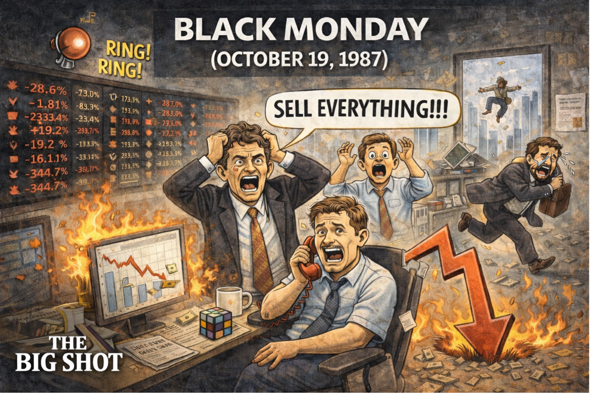
  

  
Dot-Com Bubble Burst (2000)

  
Pre-crisis window: 1998/03/10 – 2000/03/10

  
Crisis window : 2000/03/10 – 2001/03/10

  
The late 1990s were defined by intense speculation surrounding internet and technology companies.

  
Stock prices soared despite many firms having questionable business models and minimal revenue — optimism was so high that some companies doubled in valuation just by adding “.com” to their names.

  
On March 10, 2000, the bubble burst, triggering a prolonged collapse in tech valuations and a nearly <strong>80% decline in the NASDAQ</strong>.

  
Because this crisis was heavily sector-concentrated, it offers a natural laboratory for analysing industry-specific early-warning behaviour.

  

      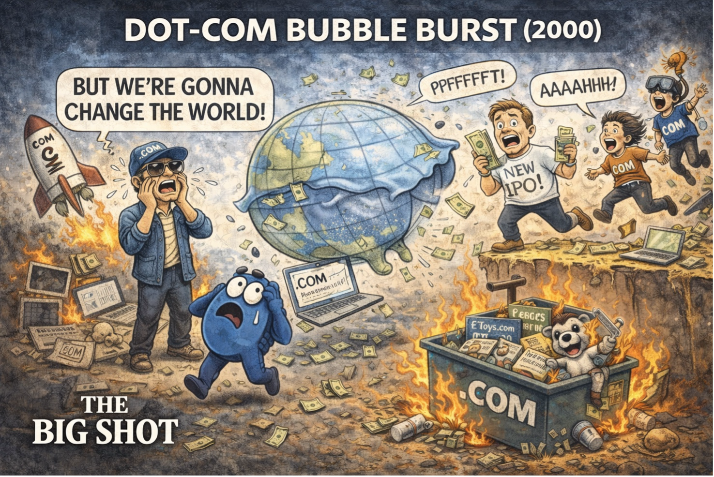
  

  
Global Financial Crisis (2008)

  
Pre-crisis window : 2006/09/15 – 2008/09/15

  
Crisis window : 2008/09/15 – 2009/09/15

  
The 2008 crisis began with stresses in the U.S. mortgage market before expanding into a global financial meltdown.

  
When Lehman Brothers filed for bankruptcy on September 15, 2008 — the largest in U.S. history — panic rippled across markets.

  
Excessive leverage, correlated defaults, and opaque derivatives created a deeply interconnected system that unravelled rapidly.

  
Importantly, many studies suggest that structural tensions were already rising well before the crash — making 2008 the quintessential case for searching for pre-crisis signals.

  

      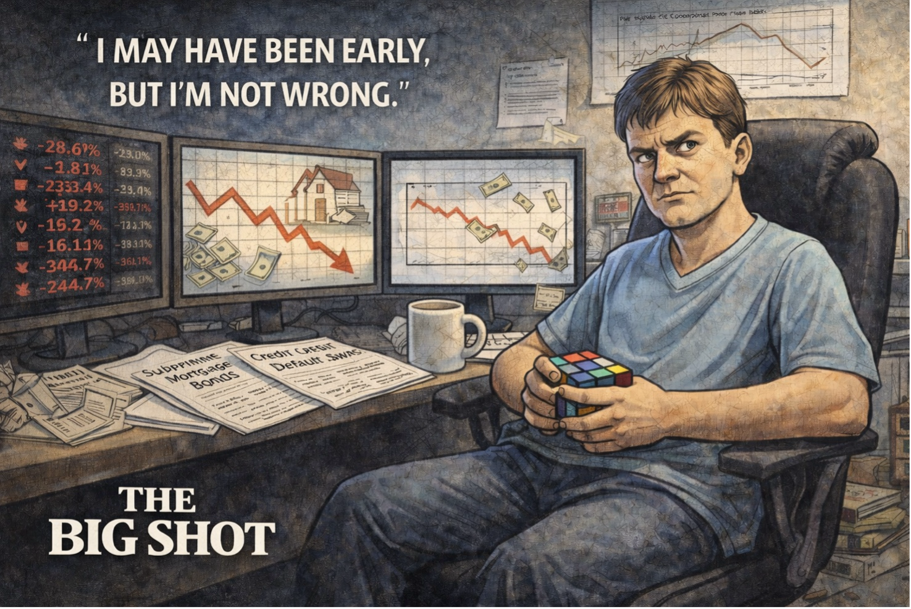
  

  
With the crises and their windows defined, we now build the crisis-specific data panels needed to compare <strong>pre-crisis</strong> and <strong>during-crisis</strong> behaviour.

  
What follows is a structured, multi-layer investigation that climbs from market-level patterns to sector-level effects and finally to predictive breakdowns.

  
Research Question 1

  
To address RQ1, our strategy is to look beyond individual price movements and focus on how assets behave <strong>together</strong>.

  
Financial crises are rarely driven by isolated events; they emerge when markets become increasingly interconnected.

  
For this reason, we study correlations rather than levels, and we do so for features that capture complementary dimensions of market behavior.

  
Log returns reflect <strong>price co-movements</strong>, revealing whether assets start moving in sync as stress builds up.

  
Volatility captures <strong>shared uncertainty</strong>, highlighting moments when risk rises simultaneously across the market.

  
Trading volumes provide a window into <strong>collective participation and attention</strong>, signaling whether investors react in a coordinated way.

  
By tracking how correlations in these features evolve before and during crises, we aim to detect early signs of tightening market linkages—patterns that suggest not <strong>where</strong> prices will go, but <strong>how</strong> the market structure itself changes as a crisis unfolds.

  
Crisis 1: Black Monday – Stock Market Investigation

  
Here display interactive heatmap labelled “interactive_correlation_black_monday_stocks”

  
  

    

      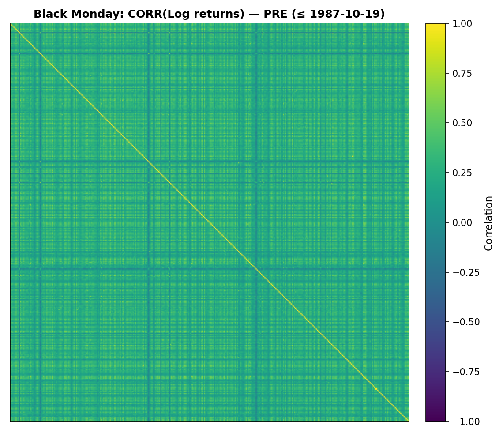
    

    

      
    

  

  
In the period surrounding Black Monday, stock-level correlations show a clear asymmetry across features.

  
Log returns and trading volumes exhibit relatively low and dispersed correlations for most of the pre-crisis window, suggesting that stocks still retain a meaningful degree of independence.

  
In contrast, correlations in volatility are consistently high, with pronounced peaks during the crisis itself.

  
Most interestingly, we observe a <strong>gradual increase in correlation</strong> in both log returns and volatility in the months leading up to the crash.

  
This points to a slow buildup of common risk, where uncertainty begins to affect many stocks simultaneously even before prices fully synchronize.

  
Given the sudden nature of the 1987 crash, this pattern suggests that stress may have been accumulating beneath the surface, becoming visible first through volatility rather than through prices themselves.

  
Crisis 2: Dot Com Bubble – Stock Market Investigation

  
Here display interactive heatmap labelled “interactive_correlation_dot_com_stocks”

  

    

      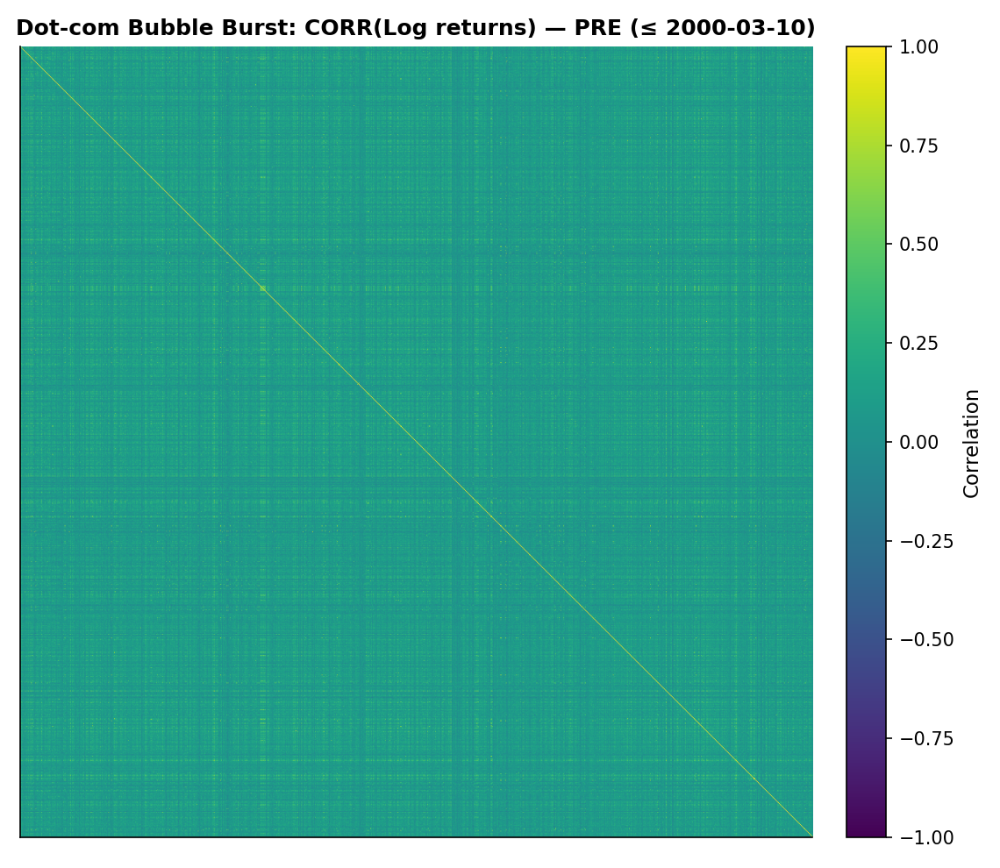
    

    

      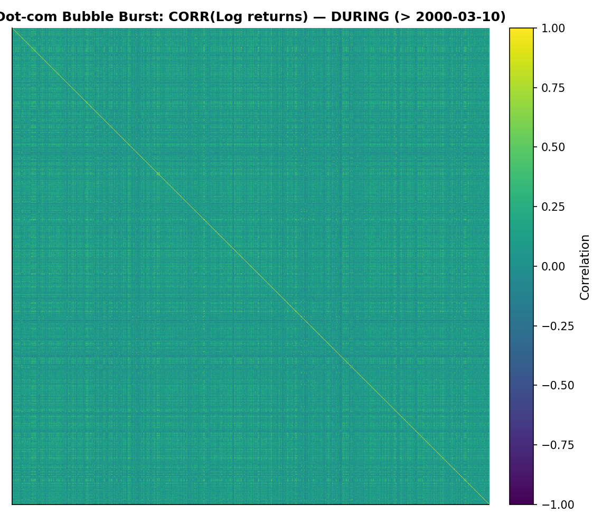
    

  

  
For the Dot-com episode, trading volumes appear largely uninformative: volume correlations remain low and scattered throughout the entire window, offering little evidence of coordinated trading behavior across stocks.

  
Log-return correlations increase modestly in the years preceding the crash, but remain overall low, indicating that price movements were still largely stock-specific.

  
This aligns well with the nature of the dot-com bubble, which was driven by highly heterogeneous firm-level narratives rather than broad macroeconomic forces.

  
Volatility correlations display a fragmented structure, with many weak or even negative relationships across stocks.

  
While correlations rise somewhat before the crisis, they <strong>decrease during the bubble burst itself</strong>, suggesting that risk was unevenly distributed and that the collapse unfolded in a more sector- and firm-specific manner than in later systemic crises.

  
Crisis 2: Dot Com Bubble – ETF Market Investigation

  
Here display interactive heatmap labelled “interactive_correlation_dot_com_etfs”

  

    <iframe src="assets/charts/interactive_correlation_dotcom_burst_etfs.html" class="plotly-chart"></iframe>
  

  
The ETF market tells a very different story during the dot-com period.

  
Volume correlations remain weak and sparse, reinforcing the idea that volume may not be the most informative feature for detecting early-warning signals.

  
In contrast, correlations of log returns and especially of volatility are <strong>consistently high across all windows</strong>, with striking peaks immediately before the crisis.

  
This is likely due to the aggregated nature of ETFs: because they bundle multiple assets, they naturally respond more uniformly to market-wide sentiment.

  
The unusually high volatility correlations right before the crash suggest that ETFs may amplify signals of systemic uncertainty earlier than individual stocks, reflecting their growing role as instruments for broad market exposure during that period.

  
Crisis 3: Great Financial Crisis – Stock Market Investigation

  
Here display interactive heatmap labelled “interactive_correlation_financial_crisis_stocks”

  

    

      
    

    

      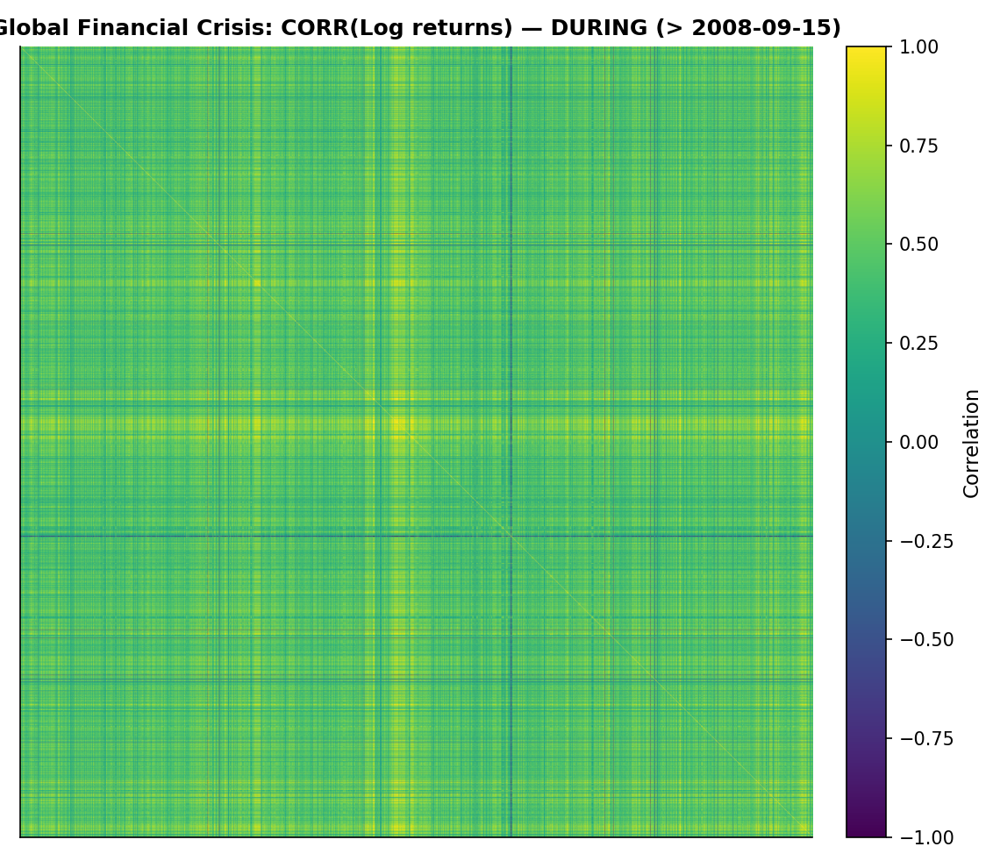
    

  

  
During the Global Financial Crisis, a clear and progressive pattern emerges.

  
Volume correlations increase steadily over time, though they remain relatively sparse overall, indicating growing—but uneven—coordination in trading activity.

  
More importantly, both log-return correlations and volatility correlations show a <strong>persistent upward trend</strong> throughout the pre-crisis window, with volatility correlations clearly dominating.

  
This suggests that uncertainty becomes increasingly synchronized across stocks well before the crisis officially unfolds.

  
Unlike earlier episodes, the GFC exhibits a strong systemic buildup, consistent with the widespread interconnectedness of financial institutions and balance sheets.

  
The dominance of volatility correlations reinforces the idea that <strong>shared risk perceptions</strong> may be one of the earliest detectable signals of a coming crisis.

  
Crisis 3: Great Financial Crisis – ETF Market Investigation

  
Here display interactive heatmap labelled “interactive_correlation_financial_crisis_etfs”

  

    <iframe src="assets/charts/interactive_correlation_financial_crisis_etfs.html" class="plotly-chart"></iframe>
  

  
In the ETF market, volume correlations remain weak and offer limited insight, consistent with earlier findings.

  
However, correlations in log returns and volatility rise dramatically as the crisis approaches.

  
The increase is both sharp and widespread, resulting in dense clusters in the correlation matrices.

  
This likely reflects the growing use of ETFs for <strong>hedging, risk transfer, and rapid portfolio reallocation</strong> during periods of stress.

  
As investors adjust exposure at the market level, ETF prices and risks move almost in lockstep.

  
The clear clustering observed here highlights the role of ETFs as conduits for systemic risk transmission during the GFC.

  
PCA Analysis: Stock Market Investigation

  
To complement the correlation analysis, we use Principal Component Analysis (PCA) as a way to summarize the market’s collective behavior in a small number of common forces.

  
When markets are calm, asset movements tend to be driven by multiple, relatively independent factors.

  
During periods of stress, however, these movements often become dominated by a single underlying force, reflecting heightened systemic risk.

  
PCA helps us capture this shift. By comparing the variance explained by the leading components before and during crises, we can assess whether market dynamics become more concentrated and synchronized.

  
In this sense, PCA does not aim to predict returns, but to reveal <strong>how many “degrees of freedom” the market effectively has</strong>.

  
A rising dominance of the first component signals that diversification is weakening and that assets are increasingly moving together—an important structural change when investigating the build-up and manifestation of financial crises.

  

    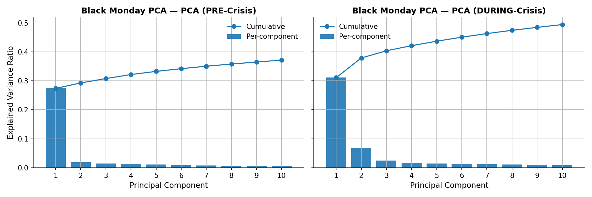
  

  

    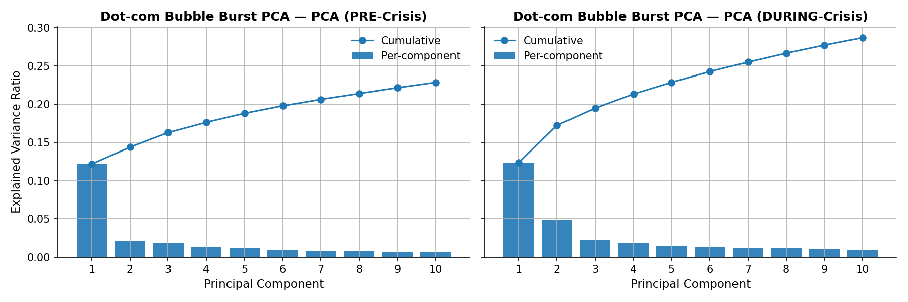
  

  

    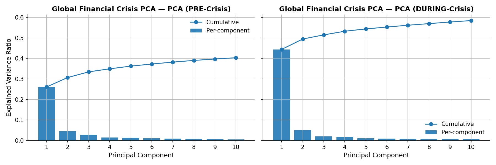
  

  
Across all three crises, a clear and consistent pattern emerges when comparing the periods before and during the crisis.

  
In the pre-crisis phases, market movements are influenced by several different forces: although the first principal component already explains a meaningful share of variability, higher-order components still play an important role, reflecting a certain degree of diversification and heterogeneous behavior across assets.

  
As markets enter crisis conditions, this structure changes markedly. The explanatory power of the first principal component increases sharply—most notably during the Global Financial Crisis—while the contribution of subsequent components diminishes.

  
This indicates a collapse in diversification, with asset movements increasingly driven by a single, dominant market-wide force.

  
The strength of this effect varies across events. It is relatively mild for Black Monday, more pronounced for the Dot-com bubble, and strongest for the Global Financial Crisis, consistent with the deep systemic interconnectedness that characterized the latter.

  
Overall, the PCA results reinforce the message already suggested by correlations: during financial crises, markets tend to move as one, and asset-specific dynamics are largely overwhelmed by common shocks.

  
PCA Analysis: Stock Market Investigation

  
Across both crises, a clear and consistent pattern emerges when comparing market behavior before and during the crisis.

  
In the period leading up to the <strong>Dot-com Bubble</strong>, market variability is spread across several underlying forces.

  
Although the first principal component already captures a significant share of overall variation, multiple components are still needed to explain most of the market’s behavior, indicating that assets retain a degree of independent movement.

  
Once the crisis begins, this structure changes sharply: variance becomes much more concentrated, with the first component alone explaining a substantially larger share.

  
This reflects a shift toward more synchronized asset movements and heightened systemic behavior.

  
An even stronger version of this pattern appears during the <strong>Global Financial Crisis</strong>.

  
Already in the pre-crisis phase, the first component explains a large fraction of variance, pointing to a highly integrated market.

  
During the crisis, this concentration intensifies further, with the first principal component overwhelmingly dominating the variance structure and leaving little room for asset-specific dynamics.

  
In practical terms, diversification becomes far less effective as market-wide shocks overpower individual asset behavior.

  
Overall, these PCA results reinforce a central insight of crisis dynamics: financial stress is accompanied by a <strong>collapse of dimensionality</strong>.

  
As crises unfold, markets move from being driven by multiple factors to being dominated by a single systemic force, causing correlations to rise and diversification benefits to shrink precisely when they are most needed.

  
Research Question 2

  
To address <strong>Research Question 2</strong>, we adopt an approach that closely mirrors the one used for the market-wide analysis, but we shift the focus from individual assets to <strong>industries</strong>.

  
The idea is to understand whether crises build up uniformly across the economy or whether certain sectors begin to move differently—and potentially signal stress—earlier than others.

  
Concretely, we aggregate asset-level features at the industry level and study how industries co-move over time.

  
By using <strong>dynamic heatmaps</strong>, we can track how correlations between industries evolve as a crisis approaches and unfolds.

  
This allows us to observe whether sectors become increasingly synchronized, whether specific industries emerge as leaders of stress, or whether sectoral differences persist until late in the crisis.

  
In this way, the industry-level analysis provides a more structured and economically meaningful view of how market stress propagates across the real economy.

  
Crisis 1: Black Monday – Industry Investigation

  
Here, display interactive heatmap labelled “interactive_correlation_black_monday_industries”

  

    <iframe src="assets/charts/interactive_correlation_black_monday_industries.html" class="plotly-chart" style="height: 750px;"></iframe>
  

  
At the industry level, Black Monday appears as an overwhelmingly systemic event.

  
During the crisis, all industries display high correlations across features, indicating that sector-specific distinctions largely disappear.

  
Even in the pre-crisis window, industries are already highly correlated for most variables, suggesting limited diversification benefits across sectors.

  
A notable spike in correlations for both log returns and volatility occurs during the crash itself.

  
Interestingly, volatility correlations become more sparse just before the crisis, possibly reflecting uneven risk buildup across sectors before the sudden market-wide shock materializes.

  
Crisis 2: Dot Com Bubble – Industry Investigation

  
Here, display interactive heatmap labelled “interactive_correlation_dotcom_burst_industries”

  

    <iframe src="assets/charts/interactive_correlation_dotcom_burst_industries.html" class="plotly-chart" style="height: 750px;"></iframe>
  

  
The industry-level picture for the dot-com bubble is markedly different.

  
Overall, correlations across industries <strong>decrease</strong> for all three features—log returns, volatility, and volumes—both before and during the crisis.

  
Log returns and volatility dominate the correlation structure, but correlations remain moderate and non-persistent.

  
Surprisingly, even the Information Technology sector does not exhibit particularly strong or stable correlations with other industries, reinforcing the idea that the bubble was driven by <strong>firm-specific narratives rather than broad sectoral or macro forces</strong>.

  
This fragmentation helps explain why early-warning signals were harder to detect during this episode.

  
Crisis 3: Great Financial Crisis – Industry Investigation

  
Here, display interactive heatmap labelled “interactive_correlation_gfc_industries”

  

    <iframe src="assets/charts/interactive_correlation_gfc_industries.html" class="plotly-chart" style="height: 750px;"></iframe>
  

  
For the GFC, industry-level correlations are extremely high across all features, with especially strong spikes in log returns and volatility.

  
As the crisis approaches, industries increasingly move together, reflecting a collapse in sectoral independence.

  
This pattern is consistent with a crisis rooted in the financial system itself, where shocks propagate rapidly across sectors through credit markets, balance sheets, and confidence channels.

  
The strong synchronization across industries underscores the <strong>systemic nature of the GFC</strong>, where diversification across sectors offered little protection.

  
Research Question 3

  
To address <strong>Research Question 3</strong>, we move from descriptive patterns to a simple statistical test and ask whether market-wide participation contains any <strong>predictive</strong> information.

  
Specifically, we investigate whether <strong>cross-sectional market breadth</strong>—the share of stocks moving up on a given day—helps explain <strong>next-day market returns</strong>, and whether this relationship changes once markets enter crisis conditions.

  
Our approach is intentionally simple. For each crisis, we estimate the same linear regression separately over the <strong>pre-crisis window</strong> and the <strong>during-crisis window</strong>, linking today’s breadth to tomorrow’s market return.

  
This setup allows us to test a clear idea: in normal times, unusually high or low participation may reflect investor sentiment or overreaction, potentially leading to short-term reversals;

  
during crises, however, market dynamics may become dominated by shocks, rendering such signals ineffective.

  
By comparing regression results across periods and crises, we can assess not only whether breadth has any predictive power, but also whether this relationship is <strong>stable or fragile</strong>.

  
In doing so, RQ3 directly complements the earlier analyses: while correlations and PCA reveal how markets <strong>move together</strong>, the regression framework tests whether any of this structure can actually be translated into short-term predictability—or whether it breaks down precisely when markets become stressed.

  

    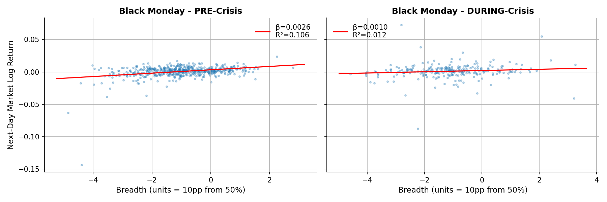
  

  

    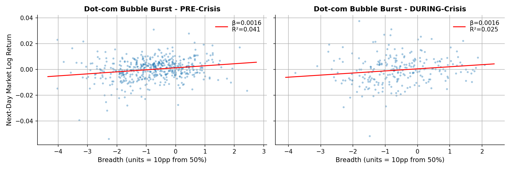
  

  

    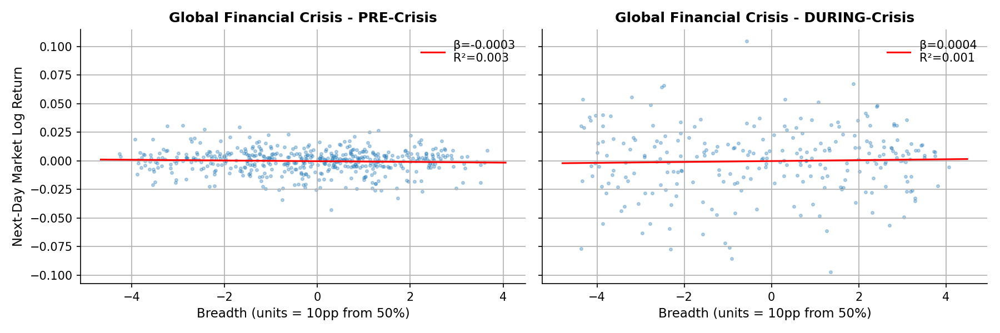
  

  
Taken together, the scatter plots and regression results show that the relationship between market breadth and next-day returns is weak and highly unstable across crises.

  
While a modest signal appears in some pre-crisis periods—most notably before Black Monday—it consistently breaks down once markets enter crisis conditions.

  
Even when statistically significant, the effects are economically negligible, with very low explanatory power.

  
Overall, these findings support a key conclusion of this project: market patterns, when they exist, are fragile and context-dependent, and they tend to disappear precisely when markets become stressed, in line with the broader evidence from our correlation and PCA analyses.

  
CONCLUSION

  
Conclusion: Are Investors Really Drunk?

  
In this project, we set out to investigate a provocative question inspired by <em>The Big Short</em>: are investors blind—or perhaps “drunk”—in the face of impending financial crises?

  
By analyzing several decades of U.S. stock and ETF data, we explored whether financial markets exhibit detectable and exploitable patterns in the periods leading up to major crises.

  
Research Question 1 asked whether common early-warning patterns exist before and during crises.

  
Our analysis shows that some patterns do emerge, particularly in the correlation structure of log returns and, even more consistently, in the correlation of volatility.

  
Across multiple crises, correlations tend to increase as markets approach stress, and they often peak during the crisis itself.

  
PCA results reinforce this finding by revealing a collapse in diversification and a dominance of market-wide forces during crises.

  
However, these patterns are neither uniform across events nor sharp enough to serve as reliable standalone warning signals.

  
They indicate rising systemic risk, but they do not provide a clear or timely “alarm bell” that a crisis is imminent.

  
Research Question 2 focused on industry-level behavior. Here, we find that sector dynamics depend strongly on the nature of the crisis.

  
During systemic events such as the Global Financial Crisis, industries become highly synchronized, reducing the benefits of sector diversification.

  
In contrast, during the Dot-com bubble, industry correlations were weaker and more fragmented, reflecting the firm- and sector-specific nature of that episode.

  
This suggests that industry-level patterns can provide valuable context, but their usefulness depends on whether a crisis is broad and systemic or concentrated in specific parts of the economy.

  
Research Question 3 examined whether cross-sectional market breadth has predictive power for next-day returns.

  
The results are clear: any predictive relationship is weak, unstable, and highly regime-dependent.

  
While some signals appear in certain pre-crisis periods, they consistently break down during crises themselves.

  
Even when statistically significant, the effects are economically negligible. This confirms that simple predictive relationships are fragile and tend to fail precisely when markets become most turbulent.

  
Taken together, these findings lead us to the core question of the project: are investors drunk?

  
Our answer is no—but not because markets are perfectly rational or easy to read.

  
The data suggest that markets do exhibit warning signs in the buildup to crises, particularly through increasing correlation and volatility synchronization.

  
However, these signals are at best necessary but not sufficient conditions for a crisis.

  
They lack timing precision, vary across events, and cannot be reliably translated into actionable forecasts.

  
Moreover, our study has important limitations. We focus on historical data, specific crises, and a fixed set of features.

  
Real-world investors face additional challenges: structural breaks, policy interventions, evolving market microstructure, and information that is only partially observable in real time.

  
Expecting investors to consistently identify crises in advance using noisy and ambiguous signals is unrealistic.

  
In conclusion, investors are not drunk—they are navigating an inherently complex system where patterns exist but clarity does not.

  
Markets may whisper before they crash, but they rarely shout.

